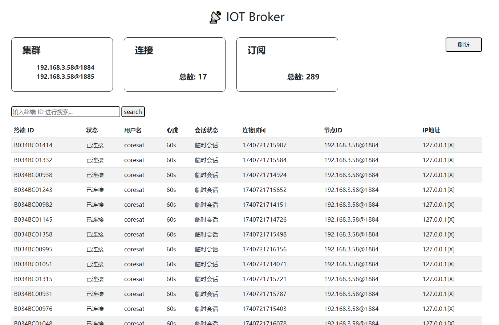

## IoT Broker

**🚀 一个基于 Spring Boot 集成 Moquette 和 RocketMQ 的物联网消息代理（IoT Broker）。支持 MQTT 协议，实现消息发布、订阅及持久化。**


## 🌟 功能特点

**MQTT 协议支持：**基于 Moquette 实现 MQTT 代理，支持 QoS 0、1、2。
**消息持久化：**采用 RocketMQ 作为消息队列，支持消息存储和异步消费。
**设备管理**：支持设备认证、在线状态管理、消息转发等。
**分布式部署**：可水平扩展，适用于大规模物联网场景。
**Spring Boot 整合：**方便开发、维护，提供 RESTful API 进行管理。


## 🛠 技术栈

| 组件            | 说明                         |
| --------------- | ---------------------------- |
| **Spring Boot** | 轻量级 Java Web 框架         |
| **Moquette**    | MQTT 服务器，支持 MQTT 3.1.1 |
| **RocketMQ**    | 高性能分布式消息队列         |
| **Redis**       | 设备会话缓存                 |


## 🌍 管理页面（http://ip:port/index）



## **🔑  设备认证**

### **认证类型支持**：

- 缺省值（默认成功）
- HTTP API 认证
- ~~数据库认证~~

### 调用示例

##### HTTP认证方式

认证服务的配置可以通过 `application.yml` 或 `application.properties` 文件进行设置

```yaml
moquette:
  auth:
    type: http  # 认证方式: 暂时支持http，后续可扩展其他的方式
    httpUrl: http://localhost:10085/api/mqtt/auth #认证接口地址，鉴权器使用POST方式发起认证请求
    httpTimeout: 3000
```

请求体示例：

```json
{
  "clientId": "device123",
  "username": "mqtt_user",
  "password": "password123"
}
```

成功响应示例：

```json
{
  "authenticated": true
}
```

失败响应示例：

```json
{
  "authenticated": false,
  "error": "Invalid username or password"
}
```
Redis

------

## **🎉   消息接入与发布**

### **消息发布**
考虑到分布式场景，消息路由统一由Rocketmq完成，平台侧业务模块向终端发布消息时，仅需将消息发布到Rocketmq指定topic（server-message-topic），Broker所有节点将监听mq消息并向终端转发。

```java
// 注意：需要发往Rocketmq中固定的topic
void publishMessage(@RequestBody CommonMqttMessage mqttMessage) {
    rocketMQProducer.sendMessage("server-message-topic", JSON.toJSONString(mqttMessage));
}
```

### **消息接入**

#### 普通消息

终端发往业务服务的消息，通过Broker代理转发到mq的client-message-topic，业务模块监听消息并实现消费

```java
/**
 * PlatSideCommonMsgConsumer 平台侧的普通消息消费者
 *
 * @author Created by wangzaihong on 2025/02/26
 */
@Slf4j
@Component
@RocketMQMessageListener(topic = RocketmqTopic.CLIENT_MESSAGE_TOPIC, consumerGroup = "client-message-group", consumeMode = ConsumeMode.CONCURRENTLY, messageModel = MessageModel.CLUSTERING)
public class PlatSideCommonMsgConsumer implements RocketMQListener<String> {

    @Override
    public void onMessage(String message) {
        log.info("receive client message: {}", message);
    }
}
```

#### 终端上下线消息

终端上下线事件，通过Broker代理转发到mq的session-change-topic，业务模块监听消息并实现消费

```java
/**
 * PlatSideSessionChangeConsumer 平台侧的终端状态消息消费者
 *
 * @author Created by wangzaihong on 2025/02/26
 */
@Slf4j
@Component
@RocketMQMessageListener(topic = RocketmqTopic.SESSION_CHANGE_TOPIC, consumerGroup = "session-message-group", consumeMode = ConsumeMode.ORDERLY, messageModel = MessageModel.CLUSTERING)
public class PlatSideSessionChangeConsumer implements RocketMQListener<String> {

    @Override
    public void onMessage(String message) {
        // 可以修改平台侧设备状态等
        log.info("receive client status  message: {}", message);
    }
}
```